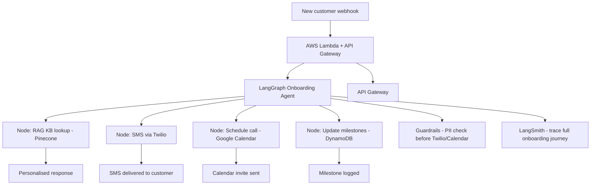

# Project 30 — Intelligent Customer Onboarding Agent


## Business Problem
New customer onboarding is one of the highest-impact moments in the customer lifecycle.
Poor onboarding leads to churn within the first 30 days — a loss of all customer acquisition
costs. Most companies automate only the first welcome email. A truly intelligent onboarding
agent: personalises every interaction, answers product questions instantly, schedules check-ins,
and tracks which customers are falling behind — intervening proactively before they churn.

## Project Objective
Build a LangGraph stateful onboarding agent that:
- Personalises welcome flows based on customer profile
- Answers product questions via RAG knowledge base (Pinecone)
- Sends personalised SMS check-ins via Twilio
- Schedules follow-up calls via Google Calendar API
- Tracks onboarding milestone completion in DynamoDB
- Deployed as AWS Lambda + API Gateway (production-ready)
- Guardrails: PII detection before any external API call

## System Architecture


## Folder Structure
```
project-30-intelligent-customer-onboarding-agent/
├── app/
│   ├── agent.py            # LangGraph onboarding agent
│   ├── nodes.py            # Agent node implementations
│   ├── rag.py              # Pinecone KB for product Q&A
│   ├── twilio_client.py    # Twilio SMS integration
│   ├── calendar_client.py  # Google Calendar integration
│   ├── dynamo_client.py    # DynamoDB milestone tracking
│   └── api.py              # FastAPI + Lambda handler
├── guardrails/
│   └── safety.py           # PII detection
├── evaluation/
│   └── langsmith_eval.py
├── infra/
│   ├── Dockerfile
│   └── template.yaml       # AWS SAM template
├── tests/
│   └── test_agent.py
├── samples/
│   └── sample_kb.txt       # Product knowledge base
├── langsmith_config.py
├── .github/workflows/deploy.yml
├── .env.example
├── requirements.txt
└── README.md
```

## Setup
```bash
pip install -r requirements.txt
cp .env.example .env
uvicorn app.api:app --reload

# Deploy to AWS Lambda
sam build && sam deploy --guided
```

## Observability
- LangSmith traces the full onboarding journey per customer
- DynamoDB stores milestone completion history
- LangSmith dashboard shows where customers drop off

## Key Concepts
- LangGraph stateful agent with persistent customer state
- RAG for product Q&A (Pinecone)
- Twilio SMS API for proactive outreach
- DynamoDB for persistent onboarding state
- AWS Lambda + API Gateway production deployment
- Guardrails for PII protection before external API calls

## Time Estimate
| Mode | Time |
|---|---|
| Self-paced | 22–30 hours |
| Instructor-guided | 13–17 hours |

---

## Step-by-Step Implementation Guide

This guide walks you through building this project from scratch. Follow each step in order.

---

### Step 1: Project Setup

```bash
mkdir project-30-intelligent-customer-onboarding-agent
cd project-30-intelligent-customer-onboarding-agent
python -m venv venv && source venv/bin/activate
mkdir -p app guardrails evaluation infra tests samples
touch app/agent.py app/nodes.py app/rag.py app/twilio_client.py
touch app/calendar_client.py app/dynamo_client.py app/api.py
touch guardrails/safety.py langsmith_config.py
touch requirements.txt .env.example
```

`requirements.txt`:
```
langgraph>=0.1.0
langchain>=0.2.0
langchain-openai>=0.1.0
langchain-pinecone>=0.1.0
langsmith>=0.1.0
openai>=1.30.0
pinecone-client>=3.0.0
twilio>=9.0.0
google-api-python-client>=2.130.0
google-auth>=2.29.0
boto3>=1.34.0
mangum>=0.17.0
fastapi>=0.110.0
uvicorn>=0.29.0
pydantic>=2.0.0
python-dotenv>=1.0.0
pytest>=8.0.0
```

`.env.example`:
```
OPENAI_API_KEY=sk-your-key
PINECONE_API_KEY=your-pinecone-key
PINECONE_INDEX=onboarding-kb
TWILIO_ACCOUNT_SID=ACxxxxxxxx
TWILIO_AUTH_TOKEN=your-auth-token
TWILIO_FROM_NUMBER=+1xxxxxxxxxx
GOOGLE_SERVICE_ACCOUNT_JSON=path/to/service-account.json
GOOGLE_CALENDAR_ID=your-calendar-id@group.calendar.google.com
AWS_REGION=us-east-1
DYNAMODB_TABLE=onboarding-milestones
LANGCHAIN_TRACING_V2=true
LANGCHAIN_API_KEY=ls__your-key
LANGCHAIN_PROJECT=project-30-onboarding-agent
```

---

### Step 2: Understand the Multi-Integration Agent Architecture

The agent is a stateful LangGraph graph. Each incoming event (new customer, inbound question, scheduled check-in) maps to a different execution path through the graph:

```
action="welcome"  → welcome node → END
action="question" → answer_question node → END
action="schedule" → schedule_call node → END
action="progress" → check_progress node → send_nudge node → END
```

**Why LangGraph for this?** The onboarding journey is a state machine: each customer has a current state (what milestones they've completed), and each event moves them to a new state. LangGraph's `StateGraph` with typed state (`OnboardingState`) models this naturally. The `set_conditional_entry_point` routes incoming events to the right starting node — no `if/elif` chains in the API layer.

**Why DynamoDB for state in Lambda?** Lambda functions are stateless — each invocation starts fresh. If you stored customer state in memory, it would disappear between invocations. DynamoDB is the standard state store for serverless Lambda workflows: it's fast (<10ms for simple gets/puts), infinitely scalable, and has zero infrastructure to manage.

---

### Step 3: Build the Pinecone RAG Knowledge Base (`app/rag.py`)

```python
"""rag.py — Pinecone RAG for product knowledge base Q&A"""
import os
from langchain_openai import OpenAIEmbeddings, ChatOpenAI
from langchain_pinecone import PineconeVectorStore
from langchain.chains import RetrievalQA
from langchain.prompts import PromptTemplate
from langchain.text_splitter import RecursiveCharacterTextSplitter
from langchain_community.document_loaders import TextLoader
from pinecone import Pinecone, ServerlessSpec
from dotenv import load_dotenv
load_dotenv()

INDEX_NAME = os.getenv("PINECONE_INDEX","onboarding-kb")

PROMPT = """\
You are a helpful customer onboarding assistant. Answer the customer's question using
ONLY the product knowledge base below. If the answer is not in the KB, say:
"I don't have that information — let me connect you with a team member."

Knowledge base:
{context}

Customer question: {question}

Answer:"""


def _get_vs():
    pc = Pinecone(api_key=os.getenv("PINECONE_API_KEY"))
    if INDEX_NAME not in [i.name for i in pc.list_indexes()]:
        pc.create_index(name=INDEX_NAME, dimension=1536, metric="cosine",
                        spec=ServerlessSpec(cloud="aws", region="us-east-1"))
    return PineconeVectorStore(index_name=INDEX_NAME,
                               embedding=OpenAIEmbeddings(model="text-embedding-3-small"))


def ingest_knowledge_base(source_path: str = "samples/sample_kb.txt"):
    docs     = TextLoader(source_path).load()
    splitter = RecursiveCharacterTextSplitter(chunk_size=500, chunk_overlap=80)
    chunks   = splitter.split_documents(docs)
    vs       = _get_vs()
    vs.add_documents(chunks)
    print(f"Ingested {len(chunks)} chunks from {source_path}")


def get_product_answer(question: str) -> dict:
    vs     = _get_vs()
    llm    = ChatOpenAI(model="gpt-4o", temperature=0.1)
    prompt = PromptTemplate(template=PROMPT, input_variables=["context","question"])
    chain  = RetrievalQA.from_chain_type(
        llm=llm, retriever=vs.as_retriever(search_kwargs={"k":3}),
        return_source_documents=True, chain_type_kwargs={"prompt": prompt})
    result  = chain.invoke({"query": question})
    sources = list({doc.metadata.get("source","KB") for doc in result["source_documents"]})
    return {"answer": result["result"], "sources": sources}
```

**Why a knowledge base instead of hardcoded FAQ responses?** Product documentation changes. Hardcoded answers go stale — pricing changes, features are added, workflows change. A RAG knowledge base lets you update the product docs in `sample_kb.txt` and re-ingest — all answers automatically update without touching any agent code.

**Why `k=3` for onboarding Q&A?** Onboarding questions tend to be specific ("how do I connect my Slack workspace?"). Top-3 retrieval finds the most relevant section without overwhelming the LLM with irrelevant content. Compare with a research assistant (k=5) where broader context helps.

---

### Step 4: Implement the Twilio SMS Client (`app/twilio_client.py`)

```python
"""twilio_client.py — Twilio SMS integration"""
import os
from twilio.rest import Client
from dotenv import load_dotenv
load_dotenv()

_client = None

def _get_client():
    global _client
    if not _client:
        _client = Client(os.getenv("TWILIO_ACCOUNT_SID"), os.getenv("TWILIO_AUTH_TOKEN"))
    return _client


def send_welcome_sms(to_number: str, customer_name: str, product_name: str) -> dict:
    """Send a personalised welcome SMS to a new customer."""
    message = _get_client().messages.create(
        body=(f"Hi {customer_name}! Welcome to {product_name}. "
              "We're excited to have you on board. "
              "Reply with any questions and our team will help you get started. 🚀"),
        from_=os.getenv("TWILIO_FROM_NUMBER"),
        to=to_number,
    )
    return {"sid": message.sid, "status": message.status, "success": message.status != "failed"}


def send_checkin_sms(to_number: str, customer_name: str, checkin_number: int) -> dict:
    """Send a check-in SMS to a customer who may be falling behind in onboarding."""
    messages = {
        1: f"Hi {customer_name}! Just checking in — have you had a chance to complete your setup? "
           "We're here to help if you get stuck.",
        2: f"Hi {customer_name}! We noticed you haven't completed onboarding yet. "
           "Would a quick call help? Reply YES and we'll schedule one.",
    }
    body = messages.get(checkin_number, messages[1])
    message = _get_client().messages.create(
        body=body, from_=os.getenv("TWILIO_FROM_NUMBER"), to=to_number)
    return {"sid": message.sid, "status": message.status,
            "success": message.status != "failed"}
```

**Why lazy-load the Twilio client?** `_get_client()` creates the client on first use, not at module import. For Lambda, this avoids the authentication overhead on imports that don't use Twilio. It also makes unit testing easier — mock `_get_client()` and no real Twilio calls are made.

**Get a Twilio number:** Sign up at twilio.com → free trial gives you $15 credit. Buy a phone number ($1/month). Add your own mobile number to the "Verified Caller IDs" list for testing.

---

### Step 5: Implement the Google Calendar Client (`app/calendar_client.py`)

```python
"""calendar_client.py — Google Calendar integration for scheduling onboarding calls"""
import os
from datetime import datetime, timedelta, timezone
from googleapiclient.discovery import build
from google.oauth2 import service_account
from dotenv import load_dotenv
load_dotenv()

SCOPES      = ["https://www.googleapis.com/auth/calendar"]
CALENDAR_ID = os.getenv("GOOGLE_CALENDAR_ID","primary")


def _get_service():
    creds = service_account.Credentials.from_service_account_file(
        os.getenv("GOOGLE_SERVICE_ACCOUNT_JSON"), scopes=SCOPES)
    return build("calendar","v3", credentials=creds)


def schedule_onboarding_call(customer_name: str, customer_email: str,
                              days_from_now: int = 7) -> dict:
    """Schedule a 30-minute onboarding check-in call and invite the customer."""
    start_dt = datetime.now(timezone.utc) + timedelta(days=days_from_now)
    start_dt = start_dt.replace(hour=10, minute=0, second=0, microsecond=0)
    end_dt   = start_dt + timedelta(minutes=30)

    event = {
        "summary": f"Onboarding Check-in — {customer_name}",
        "description": f"30-minute onboarding check-in call with {customer_name}.",
        "start": {"dateTime": start_dt.isoformat(), "timeZone": "UTC"},
        "end":   {"dateTime": end_dt.isoformat(),   "timeZone": "UTC"},
        "attendees": [{"email": customer_email}],
        "reminders": {"useDefault": False,
                       "overrides": [{"method": "email", "minutes": 60},
                                      {"method": "popup", "minutes": 15}]},
    }

    service      = _get_service()
    created_event = service.events().insert(calendarId=CALENDAR_ID, body=event,
                                             sendUpdates="all").execute()
    return {"event_id": created_event["id"], "event_link": created_event.get("htmlLink"),
            "scheduled_for": start_dt.isoformat(), "success": True}
```

**Setup for Google Calendar API:**
1. Google Cloud Console → Create a service account
2. Grant "Calendar editor" access to the service account on your calendar
3. Download the JSON key file → set `GOOGLE_SERVICE_ACCOUNT_JSON` to the file path
4. Get your calendar ID: Google Calendar → Settings → Scroll to "Calendar ID"

**Why a service account instead of OAuth?** OAuth requires user interaction (browser login flow). A service account uses a JSON key file for server-to-server authentication — perfect for Lambda where there's no user to interact with.

---

### Step 6: Implement the DynamoDB Client (`app/dynamo_client.py`)

```python
"""dynamo_client.py — DynamoDB milestone tracking"""
import os, boto3
from datetime import datetime, timezone
from dotenv import load_dotenv
load_dotenv()

_table = None

def _get_table():
    global _table
    if not _table:
        dynamodb = boto3.resource("dynamodb", region_name=os.getenv("AWS_REGION","us-east-1"))
        _table   = dynamodb.Table(os.getenv("DYNAMODB_TABLE","onboarding-milestones"))
    return _table


def update_milestone(customer_id: str, milestone: str) -> None:
    """Record that a customer has reached a milestone."""
    _get_table().put_item(Item={
        "customer_id": customer_id,
        "milestone":   milestone,
        "timestamp":   datetime.now(timezone.utc).isoformat(),
    })


def get_milestones(customer_id: str) -> list[str]:
    """Get all milestones completed by a customer."""
    resp = _get_table().query(
        KeyConditionExpression=boto3.dynamodb.conditions.Key("customer_id").eq(customer_id))
    return [item["milestone"] for item in resp["items"]]


def get_completion_rate(customer_id: str) -> float:
    """Return onboarding completion as a fraction (0.0–1.0)."""
    required = {"welcome_sent","rag_answered","check_in_1_sent","check_in_2_sent","call_scheduled"}
    completed = set(get_milestones(customer_id))
    return len(required & completed) / len(required)
```

**Why DynamoDB instead of PostgreSQL for this?** Lambda has no persistent connections — PostgreSQL requires a connection pool (RDS Proxy adds cost and complexity). DynamoDB uses HTTP for each operation, which is stateless and Lambda-native. For a simple key-value milestone store, DynamoDB's data model is a perfect fit with no schema migrations needed.

---

### Step 7: Build the Agent Nodes (`app/nodes.py`)

```python
"""nodes.py — LangGraph onboarding agent node implementations"""
from langsmith_config import setup_langsmith
from rag import get_product_answer
from twilio_client import send_welcome_sms, send_checkin_sms
from calendar_client import schedule_onboarding_call
from dynamo_client import update_milestone, get_completion_rate

setup_langsmith("project-30-onboarding-agent")


def node_welcome(state: dict) -> dict:
    """Send welcome SMS and log milestone."""
    customer = state["customer"]
    result   = send_welcome_sms(
        to_number=customer.get("phone",""),
        customer_name=customer.get("name","Customer"),
        product_name=state.get("product_name","our platform"),
    )
    update_milestone(customer["id"], "welcome_sent")
    return {"welcome_result": result, "milestone": "welcome_sent"}


def node_answer_question(state: dict) -> dict:
    """Answer a product question via RAG knowledge base."""
    question = state.get("customer_question","")
    if not question:
        return {"rag_answer":"No question provided.", "sources":[]}
    result = get_product_answer(question)
    return {"rag_answer": result["answer"], "sources": result["sources"]}


def node_schedule_call(state: dict) -> dict:
    """Schedule an onboarding check-in call."""
    customer = state["customer"]
    result   = schedule_onboarding_call(
        customer_name=customer.get("name","Customer"),
        customer_email=customer.get("email",""),
        days_from_now=7,
    )
    update_milestone(customer["id"], "call_scheduled")
    return {"calendar_result": result, "milestone": "call_scheduled"}


def node_check_progress(state: dict) -> dict:
    """Check onboarding completion and decide if a nudge is needed."""
    customer_id    = state["customer"]["id"]
    completion_pct = get_completion_rate(customer_id)
    needs_nudge    = completion_pct < 0.5
    return {"completion_pct": completion_pct, "needs_nudge": needs_nudge}


def node_send_nudge(state: dict) -> dict:
    """Send a check-in SMS to customers falling behind."""
    customer = state["customer"]
    if state.get("needs_nudge"):
        result = send_checkin_sms(to_number=customer.get("phone",""),
                                  customer_name=customer.get("name","Customer"),
                                  checkin_number=1)
        update_milestone(customer["id"], "check_in_1_sent")
        return {"nudge_result": result, "milestone": "check_in_1_sent"}
    return {"nudge_result": None}
```

**Why one function per node?** Single-responsibility principle: each node does exactly one thing. `node_welcome` sends the SMS and logs the milestone — nothing else. This makes each node independently testable: you can call `node_welcome({"customer": {...}, "product_name": "Acme"})` directly in a unit test without running the full graph.

---

### Step 8: Assemble the LangGraph Agent (`app/agent.py`)

```python
"""agent.py — LangGraph onboarding agent"""
from typing import TypedDict, Optional, Annotated
import operator
from langgraph.graph import StateGraph, END
from nodes import (node_welcome, node_answer_question, node_schedule_call,
                   node_check_progress, node_send_nudge)


class OnboardingState(TypedDict):
    customer:          dict            # {id, name, email, phone, plan}
    product_name:      str
    customer_question: Optional[str]
    action:            str             # welcome | question | schedule | progress
    welcome_result:    Optional[dict]
    rag_answer:        Optional[str]
    sources:           list[str]
    calendar_result:   Optional[dict]
    completion_pct:    Optional[float]
    needs_nudge:       bool
    nudge_result:      Optional[dict]
    milestone:         Optional[str]
    warnings:          Annotated[list, operator.add]


def route_action(state: OnboardingState) -> str:
    return {"welcome": "welcome", "question": "answer_question",
            "schedule": "schedule_call", "progress": "check_progress"
            }.get(state.get("action","welcome"), "welcome")


def build_onboarding_agent():
    g = StateGraph(OnboardingState)
    g.add_node("welcome",         node_welcome)
    g.add_node("answer_question", node_answer_question)
    g.add_node("schedule_call",   node_schedule_call)
    g.add_node("check_progress",  node_check_progress)
    g.add_node("send_nudge",      node_send_nudge)

    g.set_conditional_entry_point(route_action, {
        "welcome":         "welcome",
        "answer_question": "answer_question",
        "schedule_call":   "schedule_call",
        "check_progress":  "check_progress",
    })

    g.add_edge("welcome",         END)
    g.add_edge("answer_question", END)
    g.add_edge("schedule_call",   END)
    g.add_edge("check_progress",  "send_nudge")
    g.add_edge("send_nudge",      END)

    return g.compile()


agent = build_onboarding_agent()


def run_onboarding(customer: dict, action: str = "welcome",
                   question: str = None, product_name: str = "our platform") -> dict:
    result = agent.invoke({
        "customer": customer, "product_name": product_name,
        "customer_question": question, "action": action,
        "welcome_result": None, "rag_answer": None, "sources": [],
        "calendar_result": None, "completion_pct": None,
        "needs_nudge": False, "nudge_result": None, "milestone": None, "warnings": [],
    })
    return {k: v for k, v in result.items() if v is not None}
```

**Why `set_conditional_entry_point`?** The graph has multiple possible starting nodes depending on the event type. `set_conditional_entry_point` routes the initial state to the right node via `route_action`, which reads `state["action"]`. This is cleaner than adding conditional logic to each node or building a single "router" node that calls all others.

**Why `check_progress → send_nudge` is an edge (always runs) instead of conditional?** The `node_check_progress` sets `needs_nudge=True/False`. The `node_send_nudge` checks `state.get("needs_nudge")` and only sends the SMS if True — so the conditional logic lives inside the node, not in the graph edges. Either approach works; keeping routing logic in the node makes the graph simpler to read.

---

### Step 9: Build the API + Lambda Handler (`app/api.py`)

```python
"""api.py — FastAPI + Mangum Lambda handler"""
from fastapi import FastAPI, HTTPException
from fastapi.middleware.cors import CORSMiddleware
from pydantic import BaseModel
from mangum import Mangum
from agent import run_onboarding

app = FastAPI(title="Intelligent Customer Onboarding Agent")
app.add_middleware(CORSMiddleware, allow_origins=["*"], allow_methods=["*"], allow_headers=["*"])


class OnboardingWebhook(BaseModel):
    customer:     dict   # {id, name, email, phone, plan}
    action:       str = "welcome"
    question:     str = None
    product_name: str = "our platform"


@app.get("/health")
def health(): return {"status": "ok"}


@app.post("/onboard")
def onboard(req: OnboardingWebhook):
    try:
        result = run_onboarding(req.customer, req.action, req.question, req.product_name)
        return result
    except Exception as e:
        raise HTTPException(500, str(e))


@app.get("/progress/{customer_id}")
def get_progress(customer_id: str):
    from dynamo_client import get_completion_rate, get_milestones
    return {"customer_id": customer_id,
            "completion_pct": get_completion_rate(customer_id),
            "milestones_completed": get_milestones(customer_id)}


handler = Mangum(app, lifespan="off")
```

---

### Step 10: Troubleshooting

| Error | Cause | Fix |
|---|---|---|
| `twilio.exceptions.TwilioRestException: 21608` | Twilio trial accounts can only send to verified numbers | Verify your test phone number at twilio.com/console/phone-numbers/verified |
| `google.auth.exceptions.DefaultCredentialsError` | GOOGLE_SERVICE_ACCOUNT_JSON path wrong | Use absolute path or ensure the JSON file is in the Lambda deployment package |
| `botocore.exceptions.ClientError: ResourceNotFoundException` | DynamoDB table doesn't exist | Create the table in AWS Console: `customer_id` (String, partition key), `milestone` (String, sort key) |
| `Pinecone: index not found` | Knowledge base not ingested | Run `python -c "from app.rag import ingest_knowledge_base; ingest_knowledge_base()"` |
| Lambda cold start >10s | All integrations initialised at startup | Use lazy loading (`_get_table()`, `_get_client()` patterns) for each integration |
| LangSmith shows no traces | `setup_langsmith()` not called before agent | Call it at module import in `nodes.py` before any agent invocation |

---

## Evaluation Rubric

| Criteria | Meets | Exceeds |
|---|---|---|
| **Agent routing** | Conditional entry point routes all 4 action types correctly | Progress → send_nudge edge chains correctly |
| **Integrations** | At least 2 of 4 integrations (RAG, Twilio, Calendar, DynamoDB) working | All 4 integrations working; milestones stored and retrieved from DynamoDB |
| **RAG** | Pinecone KB ingested; product questions answered | Fallback message when answer not in KB |
| **Observability** | LangSmith traces visible per onboarding event | Customer drop-off points visible in LangSmith dashboard |
| **Deployment** | Runs locally with uvicorn | Deployed to Lambda + API Gateway; SAM template complete |

---

## Interview Talking Points

1. **Why DynamoDB for state in a Lambda-based agent?** — Lambda is stateless — memory is cleared between invocations. Customer onboarding spans days to weeks across many Lambda calls. DynamoDB persists the milestone state between invocations: a customer's `completion_pct` on Day 7 reflects milestones set by Lambda calls on Days 1–6.

2. **How does the conditional routing work in LangGraph?** — `set_conditional_entry_point` calls `route_action(state)` before the graph starts executing. The function returns a string key ("welcome", "question", etc.) that maps to a node name in the routing dict. This is equivalent to a switch statement at the graph level — cleaner than a single router node that calls all others.

3. **Why PII guardrails before Twilio and Calendar calls?** — Twilio SMS and Google Calendar both receive customer personal data (phone number, email, name). If the customer's input contains additional PII (e.g., they type their SSN into the question field), PII detection strips it before it's sent to external services that log API calls. Data minimisation is a core GDPR principle.

4. **How would you measure onboarding success?** — Primary metric: completion_pct = milestones completed / total required milestones. Secondary: time-to-complete (days from first welcome to final milestone). Business metric: 30-day retention rate for customers who completed onboarding vs those who didn't. Track all in a dashboard querying DynamoDB.

5. **How would you personalise the onboarding by customer plan?** — Add a `plan` field to `OnboardingState`. Create plan-specific welcome messages and knowledge base namespaces in Pinecone (e.g., `free_plan_kb`, `enterprise_kb`). Route to the appropriate KB namespace in `node_answer_question` based on `state["customer"]["plan"]`.

---

## Bonus Extensions

- **WhatsApp integration:** Twilio also supports WhatsApp — replace SMS with WhatsApp messages using `from_='whatsapp:+1...'` for higher engagement rates (3–5× open rates vs SMS).
- **Onboarding checklist tracker:** Add a UI (Streamlit or Next.js) that shows each customer's checklist progress — visible to the customer success team in real time.
- **In-app notifications:** Add a Segment or Mixpanel integration to trigger in-app tooltip sequences based on milestone completion — combines email/SMS + in-app into a unified onboarding experience.
- **NPS survey trigger:** After `completion_pct >= 1.0`, automatically send a 1-question NPS survey via SMS — captures satisfaction at the moment of peak engagement.
